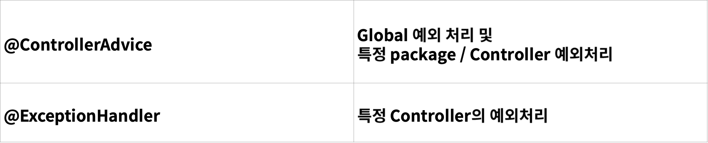

# Spring Boot Exception 처리

### Exception 처리
> Web Application 의 입장에서 바라 보았을때, 에러가 났을 때 내려줄 수 있는 방법은 많지 않다.
> 
> 1. 에러 페이지  
> 2. 4XX Error or 5XX Error  
> 3. Client가 200 외에 처리를 하지 못 할 때는 200을 내려주고 별도의 에러 Message 전달  

> 