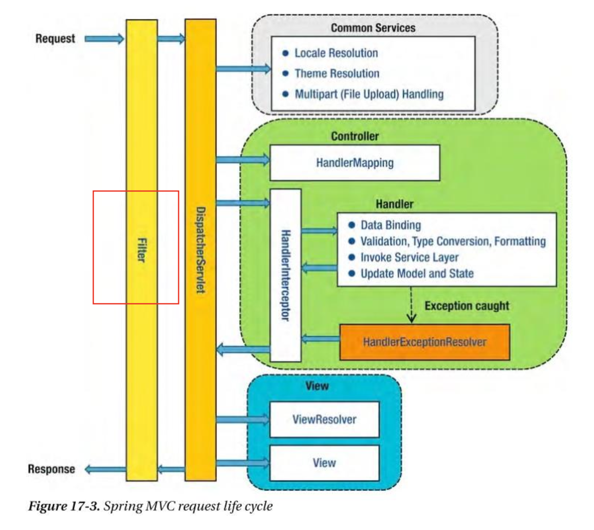
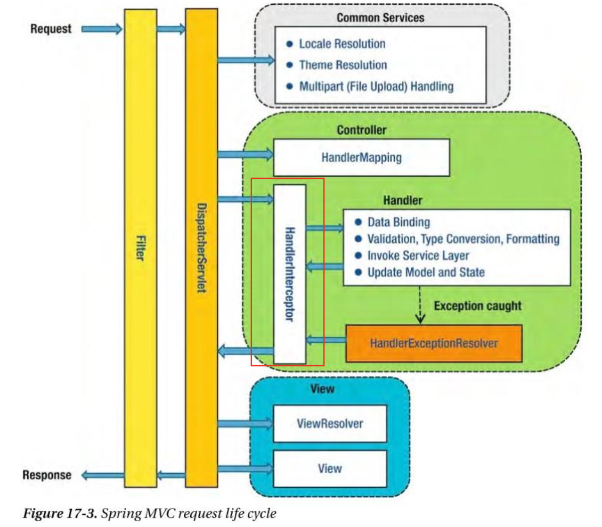

# Filter
> Filter란 Web Application에서 관리되는 영역으로써 Spring Boot Framework 에서 Client로 부터 오는   
> 요청/응답에 대해서 최초/최종 단계의 위치에 존재하며, 이를 통해서 요청/응답의 정보를 변경하거나,   
> Spring 의해서 데이터가 변환되기 전의 순수한 Client의 요청/응답 값을 확인 할 수 있다.
> 
> **유일하게 ServletRequest, ServletResponse 의 객체를 변환** 할 수 있다.
> 
> 주로 Spring Framework 에서는 request/response의 Logging 용도로 활용하거나,  
> 인증과 관련된 Logic 들을 해당 Filter에서 처리 한다.
> 
> 이를 선/후 처리 함으로써, Service business logic과 분리 시킨다.

 

### 전체적인 구성도
> 
> 
> Filter -> Interceptor -> AOP 순으로 동작

 

# Interceptor
> Interceptor 란 Filter와 매우 유사한 형태로 존재 하지만, 차이점은 Spring Context에 등록 된다.  
> AOP와 유사한 기능을 제공 할 수 있으며,
> 
> 주로 **인증 단계**를 처리 하거나, Logging 를 하는 데에 사용한다.
> 
> 이를 선/후 처리 함으로써, Service business logic과 분리 시킨다.
> 
> 