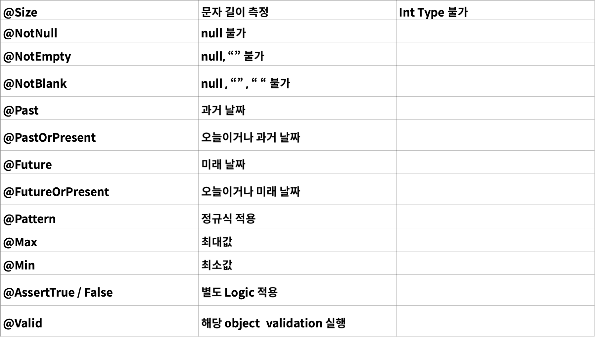

# Spring Boot Validation

### Validation
> Validation 이란 프로그래밍에 있어서 가장 필요한 부분입니다.   
> 특히 Java에서는 null 값에 대해서 접근 하려고 할 때 null pointer exception이 발생 함으로,   
> 이러한 부분을 방지 하기 위해서 미리 검증을 하는 과정을 Validation 이라고 합니다.
> 
> 단순하게는 아래와 같은 코드들 입니다.
> ```java
> public void run(String account, String pw, int age) {
>    if (account == null || pw == null) {
>        return
>    }
>    if (age == 0) {
>        return
>    }
>    // 정상 Logic
> }
> ```

<br>

> 1. 검증해야 할 값이 많은 경우 코드의 길이가 길어 진다.  
> 
> 2. 구현에 따라서 달라 질 수 있지만 Service Logic과의 분리가 필요 하다.  
>
> 3. 흩어져 있는 경우 어디에서 검증을 하는지 알기 어려우며, 재사용의 한계가 있다.  
> 
> 4. 구현에 따라 달라 질 수 있지만, 검증 Logic이 변경 되는 경우 테스트 코드 등
> 참조하는 클래스에서 Logic이 변경되어야 하는 부분이 발생 할 수 있다.

<br>

### 여러 가지 어노테이션(Annotation)
> 

<br>

### Setting
> 1. gradle dependencies
> implementation("org.springframework.boot:spring-boot-starter-validation")  
> 
> 2. bean validation spec  
> https://beanvalidation.org/2.0-jsr380/  
> 
> 3. 핸드폰번호 정규식  
> "^\\d{2,3}-\\d{3,4}-\\d{4}$"