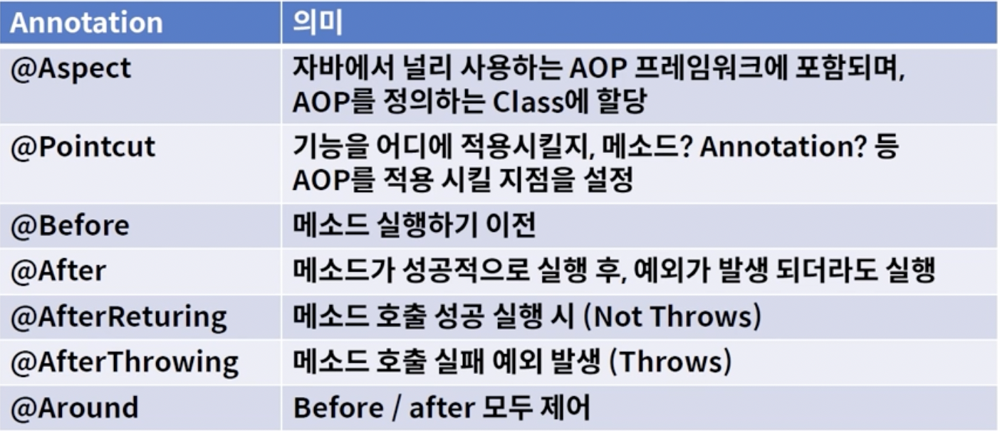

# AOP

### AOP (Aspect Oriented Programming)
> 관점지향 프로그램
> 
> 스프링 어플리케이션은 대부분 특별한 경우를 제외 하고는 MVC 웹 어플리케이션에서는 Web Layer, Bisiness Layer, Data Layer 로 정의.
>
> - Web Layer : REST API를 제공하며, Client 중심의 로직 적용 
> 
> - Business Layer : 내부 정책에 따른 logic를 개발하며, 주로 해당 부분을 개발
> 
> - Data Layer : 데이터 데이스 및 외부와의 연동을 처리

 

### 횡단 관심
> 

 

### 현재 강의에서 사용하는 주요 어노테이션(Annotation) 정리
> 

 

### 여러 가지 어노테이션(Annotation)
> 
>
> 