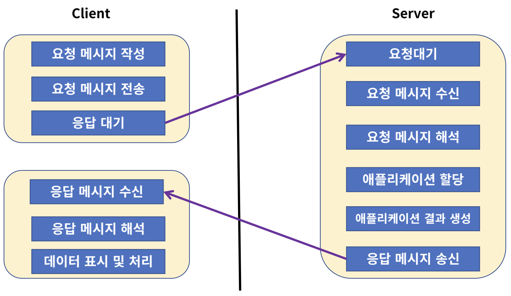
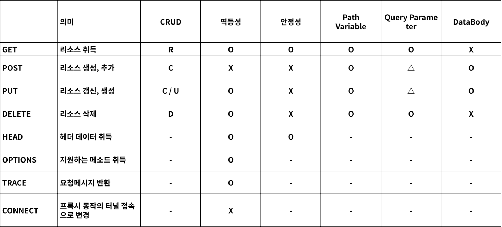
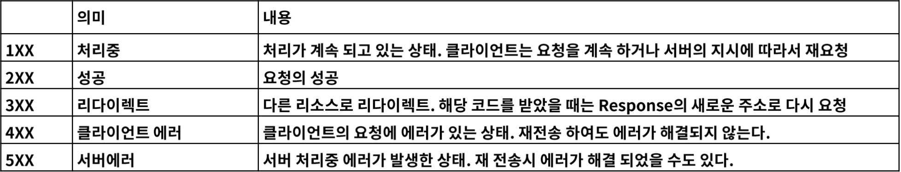
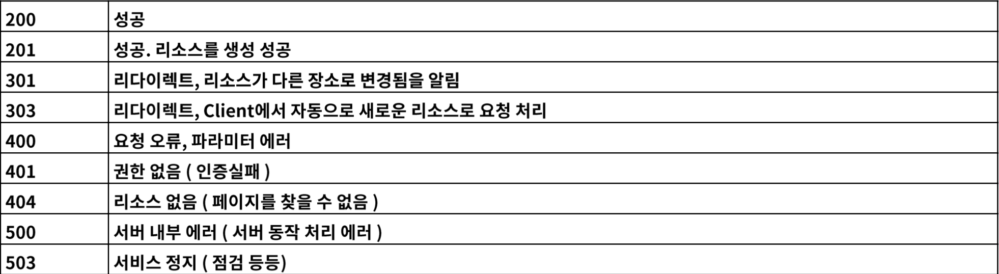

# 1. 웹 개발 개론

### 웹 이란 무엇인가?
> (World Wide Web, WWW, W3C)는 인터넷에 연결된 컴퓨터를 통해 사람들이 정보를 공유할 수 있는 전 세계적인 정보 공간을 말한다.  
> 
> Web의 용도는 다양하게 나눌 수 있습니다.  
> 
> Web Site (웹사이트)  
> google, naver, daum, facebook 등 HTML로 구성된 여러 사이트들  
> 
> API (Application Programming Interface) ⭐️ Web Service ⭐️  
> Kakao Open API, Google Open API, Naver Open API 등  
> 
> User Interface  
> Chrome, Safari, Explorer, Smart Watch, IP TV 등

 

### 웹의 기본 3가지 요소
> HTTP (HyperText Transfer **Protocol** : 어플리케이션 컨트롤)  
> GET, POST, PUT, DELETE, OPTIONS, HEAD, TRACE, CONNECT  
> 
> URI (Uniform **Resource** Identifier : 리소스 식별자)  
> 특정 사이트, 특정 쇼핑 목록, 동영상 목록 → 모든 정보에 접근 할 수 있는 정보  
>
> HTML (HyperText Markup **Language** : 하이퍼미디어 포맷)  
> XML을 바탕으로한 범용 문서 포맷 → 이를 이용하여 Chrome, Safari, Explorer에서 사용자가 알아보기 쉬운 형태로 표현

  

# 2. REST API

### REST (Representational State Transfer : 자원의 상태 전달) - 네트워크 아키텍처
> 1. Client, Server : 클라이언트와 서버가 서로 독립적으로 분리되어 있어야 한다.   
> 3. Stateless : 요청에 대해서 클라이언트의 상태를 서버에 저장하지 않는다.   
> 4. Cache : 클라이언트는 서버의 응답을 Cache(임시저장) 할 수 있어야 한다. 
   →   클라이언트가 Cache를 통해서 응답을 재사용할 수 있어야 하며, 이를 통해서 서버의 부하를 낮춘다.   
> 5. 계층화 (Layered System) : 서버와 클라이언트 사이에, 방화벽, 게이트웨이, Proxy 등   다양한 계층 형태로 구성이 가능해야 하며, 이를 확장 할 수 있어야 한다.   
> 6. 인터페이스 일관성 : 인터페이스의 일관성을 지키고, 아키텍처를 단순화시켜 작은 단위로 분리하여,   클라이언트, 서버가 독립적으로 개선 될 수 있어야 한다.   
> 7. Code on Demand (Optional) : 자바 애플릿, 자바스크립트, 플래시 등 특정한 기능을   서버로 부터 클라이언트가 전달받아 코드를 실행 할 수 있어야 한다.

  

## 인터페이스 일관성이 잘 지켜졌는지에 따라, REST를 잘 사용했는지 판단을 할 수 있다. 

### 1. 자원의 식별 → 웹 기반의 REST 에서는 리소스 접근을 할 때 URI를 사용 합니다.
> https://foo.co.kr/user/100  
Resource : user, 식별자 : 100  

 

### 2. 메세지를 통한 리소스 조작 → 웹에서는 다양한 방식으로 데이터를 전달 할 수 있습니다.
> 그 중에서 가장 많이 사용하는 방식은 HTML, XML, JSON, TEXT 등이 있습니다.  
> 
> 이 중에서 어떠한 타입의 데이터인지를 알려주기 위해서 HTTP Header 부분에  
> content-type을 통해서 데이터의 타입을 지정해 줄 수 있습니다.  
>   
> 또한 리소스 조작을 위해서 데이터 전체를 전달 하지 않고, 이를 메세지로 전달 합니다.   
>   
> Ex) 서버의 user라는 정보의 전화번호를 처음에는 number라고 결정했고, 이 정보를  
> Client와 주고 받을 때, 그대로 사용하고 있었다면, 후에 서버의 resource 변경으로 phone-number로  
> 바뀌게 된다면 Client는 처리를 하지 못 하고 에러가 납니다.  
> 
> 이러한 부분을 방지 하기 위하여, 별도의 메세지의 형태로 데이터를 주고 받으며,  
> Client-Server가 독립적으로 확장 가능하도록 합니다.  

 

### 3. 자기 서술적 메세지 → 요청 하는 데이터가 어떻게 처리 되어져야 하는지 충분한 데이터를 포함 할 수 있어야 한다.
> HTTP 기반의 REST에서는 HTTP Method와 Header 정보, 그리고 URI의 포함되는 정보로 표현 할 수 있습니다.  
> 
> GET : https://foo.co.kr/user/100, 사용자의 정보 요청   
> POST : https://foo.co.kr/user    , 사용자 정보 생성   
> PUT : https://foo.co.kr/user    , 사용자 정보 생성 및 수정   
> DELETE : https://foo.co.kr/user/100, 사용자 정보 삭제    
> 그 외에 담지 못 한 정보들은 URL의 메세지를 통하여, 표현 한다.

 

### 4. 애플리케이션(Application) 상태에 대한 엔진으로써 하이퍼미디어
> REST API를 개발할 때 단순히 Client 요청에 대한 데이터만 응답 해주는 것이 아닌 관련된  
> 리소스에 대한 Link 정보까지 같이 포함 되어져야 한다.  
> 
> 이러한 조건들을 잘 갖춘 경우 **REST Ful** 하다고 표현하고, 이를 **REST API** 라고 부릅니다.

  

# 3. URI 설계 패턴

### 1. URI (Uniform Resource Identifier)
> 인터넷에서 특정 자원을 나타내는 주소 값, 해당 값은 유일 하다. (응답은 달라질 수 있다)  
> 요청 : https://www.fastcampus.co.kr/resource/sample/1  
> 응답 : fastcampus.pdf, fastcampus.docx

 

### 2. URL (Uniform Resource Locator)
> 인터넷 상에서의 자원, 특징 파일이 어디에 위치하는지 식별 하는 주소  
> 요청 : https://www.fastcampus.co.kr/fastcampus.pdf  

 

**URL은 URI** 의 하위 개념 입니다.

  

## 1. URI 설계 원칙 (RFC-3986)
> + 슬래시 구분자 (/)는 계층 관계를 나타내는 데 사용한다.
>    + https://fastcampus.co.kr/classes/java/curriculums/web-master  
>  
> + URI 마지막 문자는 (/)는 포함하지 않는다.
>   + https://fastcampus.co.kr/classes/java/curriculums/web-master/  
>   
> + 하이픈 (-)은 URI 가독성을 높히는데 사용한다
>   + https://fastcampus.co.kr/classes/java/curriculums/web-master
>  
> + 밑줄 (_)은 사용하지 않는다.
>   + https://fastcampus.co.kr/classes/java/curriculums/web_master  
>  
> + URI 경로에는 소문자가 적합하.
>   + https://fastcampus.co.kr/classes/JAVA/curriculums/web-master (X)
>   + https://fastcampus.co.kr/classes/java/curriculums/web-master (O)   
>  
> + 파일 확장자는 URI에 포함하지 않는다.
>   + https://fastcampus.co.kr/classes/java/curriculums/web-master.jsp  
>   
> + 프로그래밍 언어에 의존적인 확장자를 사용하지 않는다.
>   + https://fastcampus.co.kr/classes/java/curriculums/web-master.do  
>  
> + 구현에 의존적인 경로를 사용하지 않는다.
>   + https://fastcampus.co.kr/servlet/java/curriculums/web-master  
>  
> + 세션 ID를 포함하지 않는다.
>   + https://fastcampus.co.kr/classes/java/curriculums/web-master?session-id=abcdef  
>  
> + 프로그래밍 언어의 Method명을 이용하지 않는다
>   + https://fastcampus.co.kr/classes/java/curriculums/web-master?action=into  
>  
> + 명사에 단수형보다는 복수형을 사용해야 한다. 컬렉션에 대한 표현은 복수 사용
>   + https://fastcampus.co.kr/classes/java/curriculums/web-master  
>  
> + 컨트롤러 이름으로는 동사나 동사구를 사용한다
>   + https://fastcampus.co.kr/classes/java/curriculums/web-master/re-order
>  
> + 경로 부분 중 변하는 부분은 유일한 값으로 대체 한다.
>   + 생략.../curriculums/web-master/lessons/{lesson-id}/users/{user-id}
>   + 생략.../curriculums/web-master/lessons/2/users/100  
>  
> + CRUD 기능을 나타내는 것은 URI에 사용하지 않는다.
>   + GET : 생략.../curriculums/web-master/lessons/2/users/100/READ (X)
>   + DELETE : 생략.../curriculums/web-master/lessons/2/users/100 (O)  
>  
> + URI Query Parameter 디자인
>   + URI 쿼리 부분으로 컬렉션 결과에 대해서 필터링 할 수 있다.
>   + 생략.../curriculums/web-master?chapter=2  
>  
> + URI 쿼리는 컬렉션의 결과를 페이지로 구하여 나타내는데 사용한다.
>   + 생략.../curriculums/web-master?chapter=2&page=0&size=10&sort=asc  
>  
> + API에 있어서 서브 도메인은 일관성 있게 사용해야 한다.
>   + https://fastcampus.co.kr
>   + https://api.fastcampus.co.kr
>   + https://api-fastcampus.co.kr  
>  
> + 클라이언트 개발자 포탈 서브 도메인은 일관성 있게 만든다.
>   + https://dev-fastcampus.co.kr
>   + https://developer-fastcampus.co.kr

  

# 4. HTTP Protocol

### HTTP Protocol 이란 무엇인가 ?
> HTTP (HyperText Transfer Protocol) 로 RFC 2616에서 규정된 Web에서 데이터를 주고 받는 프로토콜  
>
> 이름에는 하이퍼텍스트 전송용 프로토콜로 정의되어 있지만 실제로는 HTML, XML, JSON,  
> Image, Voice, Video, JavaScript, PDF 등 다양한 컴퓨터에서 다룰 수 있는 것은 모두 전송 할 수 있습니다.  
>
> HTTP는 TCP를 기반으로 한 REST의 특징을 모두 구현하고 있는 Web기반의 프로토콜

 

### HTTP는 메세지를 받고 (Request) 받는 (Response) 형태의 통신 방법

 

### HTTP의 요청을 특징하는 Method 8가지
 + REST를 구현하기 위한 인터페이스이니 알아둬야 합니다.
   + 안정성 : 호출해도 리소스를 변경하지 않는 특성
   + 멱등성 : 동일한 요청을 여러 번 보내도 한 번 보내는 것과 같은 것

 

### HTTP Status Code
 + 응답의 상태를 나타내는 코드

 

 + 자주 사용되는 코드
